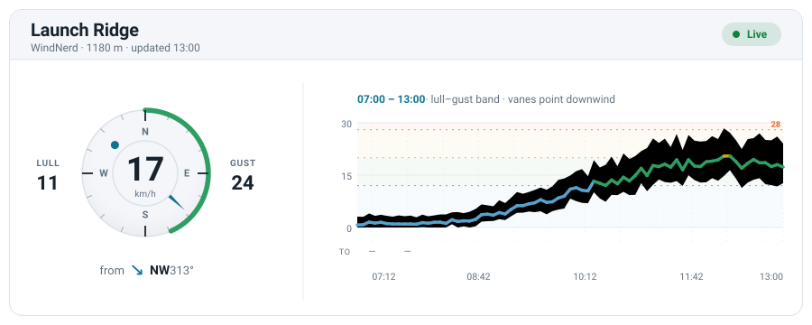
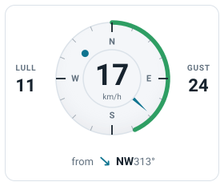
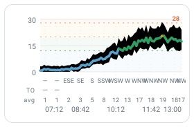
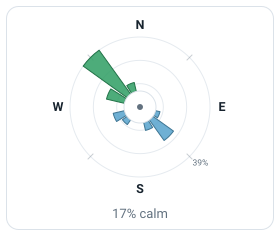
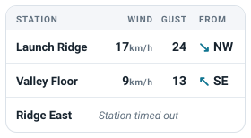

<p align="center">
  <picture>
    <source media="(prefers-color-scheme: dark)" srcset="assets/wordmark-dark.svg">
    
  </picture>
</p>

<p align="center"><em>Open tooling for wind-sport weather.</em></p>

<p align="center">
  <a href="https://github.com/azohra/meteo/actions/workflows/ci.yml"></a>
  <a href="LICENSE"></a>
  <a href="https://www.npmjs.com/package/@azohra/meteo"></a>
</p>

# Azohra Meteo

One npm package, `@azohra/meteo`, exposing each capability as an explicit
subpath import — there is deliberately no root barrel, so a lightweight
consumer never pays for a renderer it didn't ask for.

| Capability | Import | Status |
|---|---|---|
| Live weather stations | `@azohra/meteo/station` (+ `/server`, `/react`) | **Available — below** |
| Forecast pipeline | `@azohra/meteo/forecast` | Incubating at [azohra/windgram](https://github.com/azohra/windgram); migrating here |
| Windgram generator | `@azohra/meteo/gram` | Incubating at [azohra/windgram](https://github.com/azohra/windgram); migrating here |
| Soundings (Skew-T, hodograph) | `@azohra/meteo/sounding/*` | Planned |

---

# station

<p align="center"><em>Every station. One wire. Your pixels.</em></p>

<p align="center">
  <picture>
    <source media="(prefers-color-scheme: dark)" srcset="assets/hero-dark.svg">
    
  </picture>
</p>

**The station capability makes managing an inventory of heterogeneous
weather stations easy** — and renders them natively and beautifully on your
own page. No iframe, no borrowed visual vocabulary.

A station vendor's embed widget carries its own title bar, cards, and palette
into a page that has its own. Azohra Meteo goes the other way: vendor
adapters normalize every station you care about — whatever hardware it runs —
into one wire contract, a mountable handler serves the fleet as a single
feed, and reactive components render it in *your* design system with the
visual richness of a station page: instrument dial, color-graded history,
wind rose, multi-station comparison.

## Gallery

<table>
  <tr>
    <td width="25%" align="center"></td>
    <td width="25%" align="center"></td>
    <td width="25%" align="center"></td>
    <td width="25%" align="center"></td>
  </tr>
  <tr>
    <td align="center"><sub><code>CurrentConditions</code></sub></td>
    <td align="center"><sub><code>WindHistoryChart</code></sub></td>
    <td align="center"><sub><code>WindRose</code></sub></td>
    <td align="center"><sub><code>StationTable</code></sub></td>
  </tr>
</table>

Every image in this README is generated by the library itself — the dial and
rose are server renders of the real components, the chart is drawn from the
station root's geometry functions, and the palette is read from the shipped
`styles.css` tokens. `examples/demo` is the live version: every component,
every degradation shape, drawn entirely by the library.

## Install

```jsonc
// package.json — until the npm scope lands, install straight from GitHub
"dependencies": { "@azohra/meteo": "github:azohra/meteo#v0.1.0" }
```

[docs/getting-started.md](docs/getting-started.md) has the details (including
the pnpm `allowBuilds` note for git dependencies).

## Sixty seconds

```ts
// server: mount the feed (any runtime that speaks Request/Response)
import { createStationFeedHandler } from "@azohra/meteo/station/server";

export const onRequest = createStationFeedHandler({
  stations: [
    { vendor: "windnerd", id: "launch", name: "Launch", stationKey: "bluff-launch", locationId: 8675 },
    { vendor: "tempest", id: "valley", name: "Valley", stationId: 12345, token: TEMPEST_TOKEN },
  ],
});
```

```tsx
// client: render the fleet
import { StationFeedProvider, useStation, WindStation, StationTable } from "@azohra/meteo/station/react";
import "@azohra/meteo/station/react/styles.css";

function LiveWind() {
  // mount base in, polling out: `${base}/feed` + the light `${base}/current`
  const { feed, receivedAtMs } = useStation("/api/wind", "launch");
  if (!feed) return null;
  return (
    <div className="meteo-root">
      <StationFeedProvider feed={feed} receivedAtMs={receivedAtMs}
        thresholds={{ unit: "kmh", values: [12, 20, 28] }}> {/* your vocabulary; converted to the m/s wire once */}
        <WindStation />    {/* the named station, fully rendered */}
        <StationTable /> {/* the whole fleet */}
      </StationFeedProvider>
    </div>
  );
}
```

## Documentation

| Page | The single authority for |
|---|---|
| [docs/getting-started.md](docs/getting-started.md) | Install, mount the handler, render components, the data-level API |
| [docs/wire-contract.md](docs/wire-contract.md) | Document shape, semantics, evolution rules, HTTP protocol, freshness ([JSON Schema](schema/)) |
| [docs/adapters.md](docs/adapters.md) | Custom adapters, `defineStationAdapter`, the rulebook, environment injection, caching, polling etiquette |
| [docs/react.md](docs/react.md) | Provider, hooks, thresholds, composition, SSR seeding |
| [docs/theming.md](docs/theming.md) | `.meteo-root` scoping, token tables, dark mode, `@layer` |

[`station/README.md`](station/README.md) is the capability's compact
overview.

## Principles

- **Capabilities are declared, never inferred.** A station without a
  thermometer says so; a dark sensor reports null. Absence stays absent —
  never zero, never a guess.
- **Degrade, don't lie.** An upstream that fails or breaks contract renders
  as unavailable with a reason code, not as stale numbers. One broken station
  never takes down the feed.
- **No prose on the wire.** Reason codes and degrees travel; words, units,
  and colours are the client's.
- **Your thresholds, your palette.** Speed banding is computed against the
  consumer's limits and painted with the consumer's tokens.

## Adding a capability

The suite grows by convention, not scaffolding:

- A capability is a directory at the repo root (`station/`, `forecast/`,
  `gram/`, `sounding/`) exposed only through subpath exports in
  `package.json` — never a root barrel.
- Code that must not reach a client bundle lives under
  `<capability>/server`; framework bindings under `<capability>/react` (or a
  sibling); tests under `<capability>/test`.
- Shared internals live in `core/` — no package export entry, ever; anything
  a consumer should reach is re-exported by a capability's public surface.
- Each capability carries its own `README.md` and owns its wire vocabulary;
  the shared identity (wordmark, palette generation, schema `$id` host) is
  repo-level.
- `tsconfig.build.json` includes each capability directory; the export map
  and `files` array grow one entry at a time.

`station/` is the reference implementation of the convention.

## Develop

```sh
pnpm install
pnpm build
pnpm test
```

`examples/demo` renders every component against synthetic feeds:
`pnpm --dir examples/demo dev`.

`pnpm schemas` regenerates `schema/` from the built contract; a drift test
keeps the committed files honest. `pnpm readme:assets` regenerates all README
imagery through the library's own renderers — nothing is hand-drawn.
